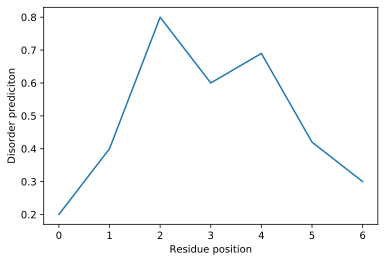
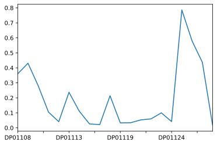
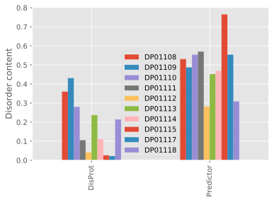
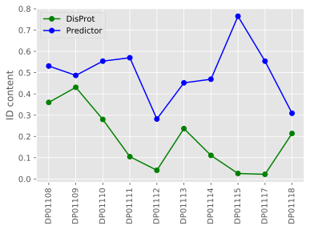
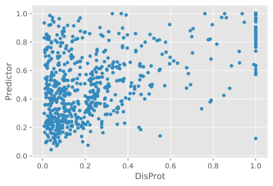
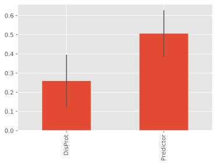
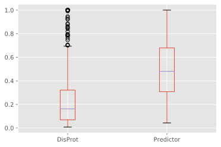

## [`matplotlib`](https://matplotlib.org/) is the most widely used scientific plotting library in Python.

*   Commonly use a sub-library called [`matplotlib.pyplot`](https://matplotlib.org/api/pyplot_api.html).
*   The Jupyter Notebook will render plots inline if we ask it to using a "magic" command.

~~~
%matplotlib inline
import matplotlib.pyplot as plt
~~~
{: .language-python}

*   Simple plots are then (fairly) simple to create.

~~~
res_position =   [0,    1,    2,   3,    4,    5,    6]    # x coords
dis_prediction = [0.31, 0.44, 0.8, 0.62, 0.69, 0.42, 0.2]  # y coords

plt.plot(res_position, dis_prediction)
plt.xlabel('Residue position')
plt.ylabel('Disorder prediciton')
~~~
{: .language-python}

## Plot data directly from a [`Pandas dataframe`](https://pandas.pydata.org/pandas-docs/stable/generated/pandas.DataFrame.html).

*   We can also plot [Pandas dataframes](https://pandas.pydata.org/pandas-docs/stable/generated/pandas.DataFrame.html).
*   This implicitly uses [`matplotlib.pyplot`](https://matplotlib.org/api/pyplot_api.html).
*   The simplest way to plot from pandas is to use the plot() method. In this case, it's not quite the right plot 
~~~
import pandas as pd

data = pd.read_csv('../data/DisProt_and_pred_IDcontent.csv', index_col=[0])
data["DisProt"].head(20).plot()
~~~
{: .language-python}

## Select data, chose the right plot.

*   By default, [`DataFrame.plot()`](https://pandas.pydata.org/pandas-docs/stable/generated/pandas.DataFrame.plot.html#pandas.DataFrame.plot) plots with the rows as the X axis.
*   In this case a bar plot seems more appropriate. We can draw it with [`Dataframe.plot.bar()`](https://pandas.pydata.org/pandas-docs/stable/reference/api/pandas.DataFrame.plot.bar.html)
*   Since we have two columns, `pandas` takes care of plotting paired bars.

~~~
data.head(10).plot(kind="bar")
plt.ylabel('GDP per capita')
~~~
{: .language-python}

## Many styles of plot are available.

*   For example, do a bar plot using a fancier style.
*   Once set, a style will apply to all following plots. To revert just set `plt.style.use('default')`
*   Transposing the [`Pandas dataframe`](https://pandas.pydata.org/pandas-docs/stable/generated/pandas.DataFrame.html) we plot two series.

~~~
plt.style.use('ggplot')
data.T.plot(kind='bar')
~~~
{: .language-python}

## Data can also be plotted by calling the `matplotlib` `plot` function directly.
*   The command is `plt.plot(x, y)`
*   The color / format of markers can also be specified as an argument: e.g. 'b-' is a blue line, 'g--' is a green dashed line.

## Get DisProt data from dataframe

~~~
entries = data.head(10).index
idcont_disprot = data['DisProt'].head(10)

plt.plot(entries, idcont_disprot, 'g--')
plt.xticks(rotation=90)
~~~
{: .language-python}

## Can plot many sets of data together.

~~~
entries = data.head(10).index
idcont_disprot = data['DisProt'].head(10)
idcont_pred = data['Predictor'].head(10)

plt.plot(entries, idcont_disprot, 'g-', marker="o", label="DisProt")
plt.plot(entries, idcont_pred, 'b-', marker="o", label="Predictor")

plt.xticks(rotation=90)
plt.ylabel("ID content")
plt.legend()
~~~
{: .language-python}

> ## Adding a Legend
> 
> Often when plotting multiple datasets on the same figure it is desirable to have 
> a legend describing the data.
>
> This can be done in `matplotlib` in two stages:
> 
> * Provide a label for each dataset in the figure:
>
> ~~~
> plt.plot(years, gdp_australia, label='Australia')
> plt.plot(years, gdp_nz, label='New Zealand')
> ~~~
>
> * Instruct `matplotlib` to create the legend.
>
> ~~~
> plt.legend()
> ~~~
>
> By default matplotlib will attempt to place the legend in a suitable position. If you
> would rather specify a position this can be done with the `loc=` argument, e.g to place
> the legend in the upper left corner of the plot, specify `loc='upper left'`
>
> {: .language-python}
{: .callout}
 

*   Plot a scatter plot correlating the ID content of DisProt and the Predictor
*   Use either `plt.scatter` or `DataFrame.plot.scatter`

~~~
plt.scatter(data['DisProt'], data['Predictor'])
~~~
{: .language-python}

~~~
data.plot.scatter("DisProt", "Predictor")
~~~
{: .language-python}

> ## Mean and std
>
> Fill in the blanks below to plot the average (mean) ID content as a bar plot.
> Modify it again to draw the standard deviation (std) as error bar.
>
> ~~~
> data = data = pd.read_csv('../data/DisProt_and_pred_IDcontent.csv', index_col=[0])
> data.mean().plot.____(yerr=_____/2)
> ~~~
> {: .language-python}
>
> > ## Solution
> >
> > ~~~
> > data = data = pd.read_csv('../data/DisProt_and_pred_IDcontent.csv', index_col=[0])
> > data.mean().plot.bar(yerr=data.std()/2)
> > ~~~
> > {: .language-python}
> > 
> {: .solution}
{: .challenge}

> ## Distributions
>
> Modify the example in the notes to create an histogram showing
> the distribution of disorder content in DisProt and the Predictor
> What differences do you see (if any)?
>
> ~~~
> data = pd.read_csv('../data/DisProt_and_pred_IDcontent.csv', index_col=[1])
> data.describe().T.hist()
> ~~~
> {: .language-python}
>
> > ## Solution
> >
> > ~~~
> > data = pd.read_csv('../data/DisProt_and_pred_IDcontent.csv', index_col=[0])
> > data.hist()
> > ~~~
> > 
> >
> > The two distributions have very different shapes. DisProt looks like an 
> > exponential decay (except for its tail) while predicted ID content has more
> > of a bell shape
> >
> {: .solution}
>
> It is not always easy to compare distributions plotted as histograms.
> A great tool to compare distribution is instead the box-plot:
> What do we notice from the comparison?
>
> ~~~
> data = pd.read_csv('../data/DisProt_and_pred_IDcontent.csv', index_col=[0])
> data.boxplot()
> ~~~
> {: .language-python}
> > ## Solution
> > 
> >
> > It is now evident that DisProt disorder content is lower overall. It has a lower
> > mean and its 3 quartile ends where the predicted 1 quartile starts. We can also notice
> > that DisProt many outliers above the main body of it distribution. 
> > This may indicate two things: either predictors over-predict, or DisProt has
> > incomplete annotations.
> >
> {: .solution}
{: .challenge}

> ## More Correlations
>
> This short script creates a plot showing
> the correlation DisProt and the Predictor ID content
> with marker size and marker color being regulated by protein length:
>
> ~~~
> data = pd.read_csv('../data/DisProt_and_pred_IDcontent_length.csv', index_col=[0])
> data.plot(kind='scatter', x='DisProt', y='Predictor', 
>           s=data['len']/50, c='len', colormap='viridis')
> ~~~
> {: .language-python}
>
> Using online help and other resources,
> explain what each argument to `plot` does.
>
> > ## Solution
> > 
> >
> > A good place to look is the documentation for the plot function -
> > help(data_all.plot).
> >
> > kind - As seen already this determines the kind of plot to be drawn.
> >
> > x and y - A column name or index that determines what data will be
> > placed on the x and y axes of the plot
> >
> > s - Details for this can be found in the documentation of plt.scatter.
> > A single number or one value for each data point. Determines the size
> > of the plotted points.
> >
> > c - Details for this can be found in the documentation of plt.scatter.
> > A single number or one value for each data point. Determines what color
> > is picked from a colormap
> > 
> > colormap - a string that indicates the name of a colormap among those 
> > included in [`matplotlib colormaps`](https://matplotlib.org/3.1.1/gallery/color/colormap_reference.html)
> >
> {: .solution}
{: .challenge}

> ## Saving your plot to a file
> 
> If you are satisfied with the plot you see you may want to save it to a file,
> perhaps to include it in a publication. There is a function in the
> matplotlib.pyplot module that accomplishes this:
> [savefig](https://matplotlib.org/api/_as_gen/matplotlib.pyplot.savefig.html).
> Calling this function, e.g. with
> ~~~
> plt.savefig('my_figure.png')
> ~~~
> {: .language-python}
> 
> will save the current figure to the file `my_figure.png`. The file format
> will automatically be deduced from the file name extension (other formats
> are pdf, ps, eps and svg).
>
> Note that functions in `plt` refer to a global figure variable
> and after a figure has been displayed to the screen (e.g. with `plt.show`) 
> matplotlib will make this variable refer to a new empty figure.
> Therefore, make sure you call `plt.savefig` before the plot is displayed to
> the screen, otherwise you may find a file with an empty plot.
>
> When using dataframes, data is often generated and plotted to screen in one line,
> and `plt.savefig` seems not to be a possible approach.
> One possibility to save the figure to file is then to
>
> * save a reference to the current figure in a local variable (with `plt.gcf`) 
> * call the `savefig` class method from that variable.
>
> ~~~
> fig = plt.gcf() # get current figure
> data.plot(kind='bar')
> fig.savefig('my_figure.png')
> ~~~
> {: .language-python}
{: .callout}

> ## Making your plots accessible
>
> Whenever you are generating plots to go into a paper or a presentation, there are a few things you can do to make sure that everyone can understand your plots.
> * Always make sure your text is large enough to read. Use the `fontsize` parameter in `xlabel`, `ylabel`, `title`, and `legend`, and [`tick_params` with `labelsize`](https://matplotlib.org/2.1.1/api/_as_gen/matplotlib.pyplot.tick_params.html) to increase the text size of the numbers on your axes.
> * Similarly, you should make your graph elements easy to see. Use `s` to increase the size of your scatterplot markers and `linewidth` to increase the sizes of your plot lines.
> * Using color (and nothing else) to distinguish between different plot elements will make your plots unreadable to anyone who is colorblind, or who happens to have a black-and-white office printer. For lines, the `linestyle` parameter lets you use different types of lines. For scatterplots, `marker` lets you change the shape of your points. If you're unsure about your colors, you can use [Coblis](https://www.color-blindness.com/coblis-color-blindness-simulator/) or [Color Oracle](https://colororacle.org/) to simulate what your plots would look like to those with colorblindness.
{: .callout}
